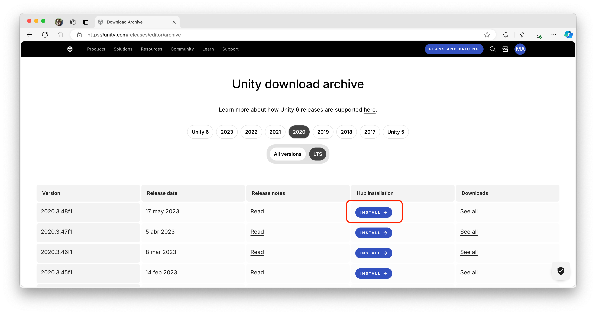
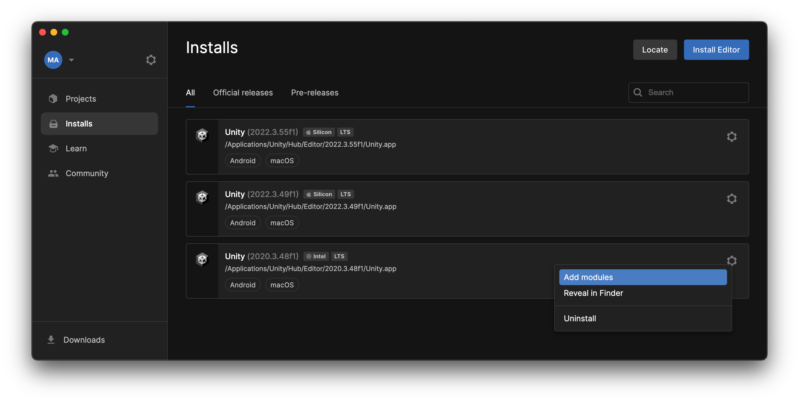
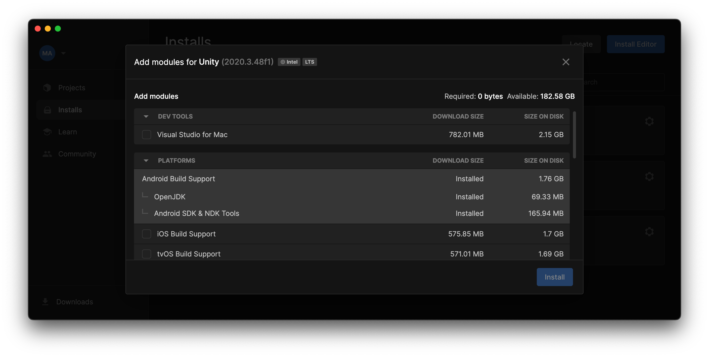
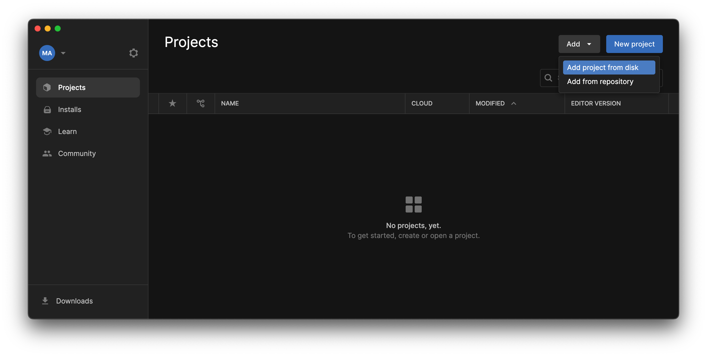
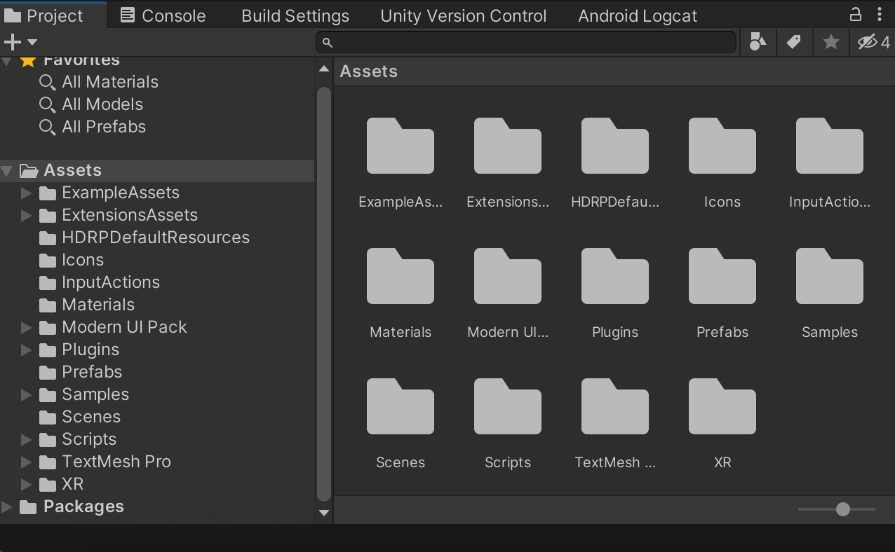
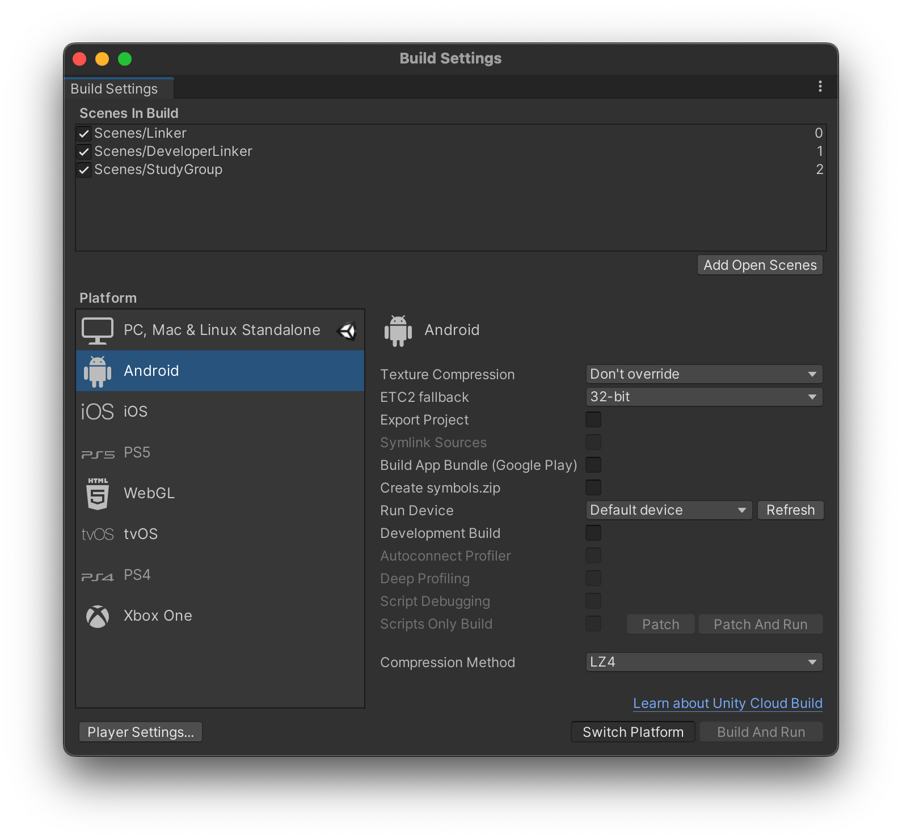

# 🛠️ Unity Setup Guide for Project Installation

## 1. System Requirements
- **Operating System**: Windows 10/11 or macOS 10.14+
- **Disk Space**: Minimum 25GB free
- **Hardware**: Graphics card supporting DX11/OpenGL 3.2+

## 2. Install Unity Hub (Version Manager)
1. **Download Unity Hub**:
   - Go to: [https://unity.com/download](https://unity.com/download)
   - Click _"Download Unity Hub"_
  
2. **Run Installer**:
   - Execute the downloaded file (`UnityHubSetup.exe` or `.dmg`)
   - Follow the installation wizard (accept all defaults)
   - Launch Unity Hub after installation

## 3. Install Unity 2022.3.55f1 (Specific Version)
1. **Get Correct Version**:
   - Access version archive: [Unity Archive](https://unity3d.com/get-unity/download/archive)
   - Locate **exact** version `2022.3.55f1`
   - Click the _"Hub installation"_ button of that version
   
   
   
2. **Installation Setup**:
   - In Unity Hub's installation window click _"Install"_ (⚠️ May take 30+ minutes)

## 4. Add Android Modules (Required)
1. **In Unity Hub**:
   - Go to _"Installs"_ tab
   - Click ⚙️ gear icon next to installed version
   - Select _"Add Modules"_

2. **Select Android Components**:
   Check **all**:
   - ✔️ Android Build Support
   - ✔️ Android SDK & NDK Tools
   - ✔️ OpenJDK

3. **Complete Installation**:
   - Click _"Install"_ (requires ~5GB additional space)
   - Wait for progress bar to complete

## 5. Open the Project
1. **Preparation**:
   - Download full project (Git repository)
   - Extract to path **without spaces/special characters** (e.g., `C:\API-AR\`)

2. **In Unity Hub**:
   - Go to _"Projects"_ tab
   - Click _"Open" → "Add project from disk"_
   - Navigate to project `/API-AR` folder (containing `Assets` and `ProjectSettings`)
   - Double-click to open (first launch takes 2-5 minutes)

## 6. Project Structure
- `Assets/` (All important content here)
  - 📁 `ARDrawing/`: ARCore setting files
  - 📁 `Icons/` - `Materials/`: UI graphics
  - 📁 `Prefabs/`: Reusable GameObjects
  - 📁 `Scenes/`: UI screens (`Main.unity` is the main scene)
  - 📁 `Scripts/`: C# code (edits via Visual Studio)
- `Packages/` (⚠️ Do not modify - auto-managed dependencies)

## 7. Build for Android (Step-by-Step)
### Requirements:
- 📱 Android phone with:
  - Version 8.0 or newer
  - Developer mode enabled
  - USB debugging turned on

### Process:
1. **Prepare Build**:
   - In Unity: `File → Build Settings`
   - Select **Android** platform (click _"Switch Platform"_ if needed)
   - Check all _"Scenes In Build"_ were added (Linker, DeveloperLinker, StudyGroup)

2. **Connect Device**:
   - USB connection with debugging approved
   - Verify that your `Run Device` is properly selected

3. **Build & Run**:
   - Click `Build And Run` button
   - Name your `.apk` file (e.g., `API_AR.apk`)
   - Wait 3-10 minutes (first build is slower)
   - App will auto-install on your phone

## 🆘 Troubleshooting Common Issues
- **SDK Errors**: Verify all Android modules installed
- **Project Won't Load**: Restart Unity Hub, check project path
- **Build Fails**: Confirm all scenes are in _"Scenes In Build"_