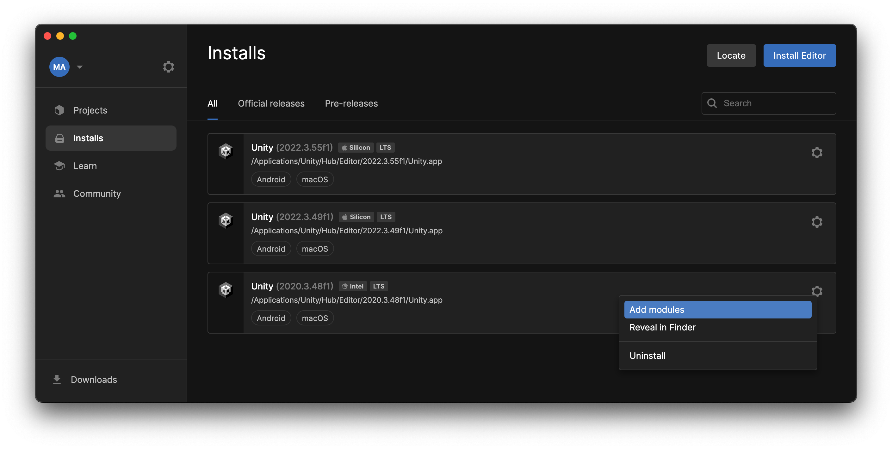
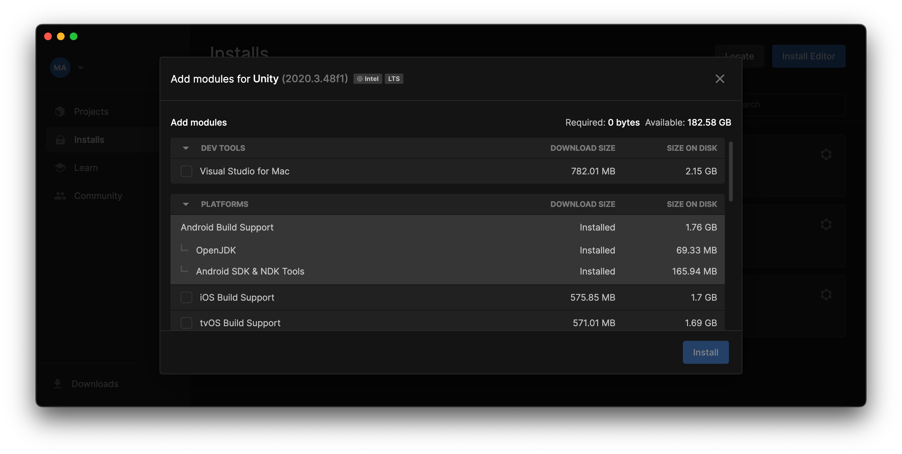

# 🛠️ Unity Setup Guide for Project Installation

## 1. System Requirements
- **Operating System**: Windows 10/11 or macOS 10.14+
- **Disk Space**: Minimum 25GB free
- **Hardware**: VR-capable graphics card (NVIDIA GTX 1060/AMD Radeon RX 480 or better)
- **VR Headset**: Oculus Rift, Meta Quest, HTC Vive, or other compatible VR device

## 2. Install Unity Hub (Version Manager)
1. **Download Unity Hub**:
   - Go to: [https://unity.com/download](https://unity.com/download)
   - Click _"Download Unity Hub"_
  
2. **Run Installer**:
   - Execute the downloaded file (`UnityHubSetup.exe` or `.dmg`)
   - Follow the installation wizard (accept all defaults)
   - Launch Unity Hub after installation

## 3. Install Unity 2022.3.55f1 (Specific Version)
1. **Get Correct Version**:
   - Access version archive: [Unity Archive](https://unity3d.com/get-unity/download/archive)
   - Locate **exact** version `2022.3.55f1`
   - Click the _"Hub installation"_ button of that version
   
   
   
2. **Installation Setup**:
   - In Unity Hub's installation window click _"Install"_ (⚠️ May take 30+ minutes)

## 4. Add VR and Android Modules (Required)
1. **In Unity Hub**:
   - Go to _"Installs"_ tab
   - Click ⚙️ gear icon next to installed version
   - Select _"Add Modules"_

2. **Select Android Components**:
   Check **all**:
   - ✔️ Android Build Support
   - ✔️ Android SDK & NDK Tools
   - ✔️ OpenJDK
   - ✔️ Windows/MacOS Build Support (depending on your OS)
   - ✔️ VR supported platforms (Oculus, OpenXR, etc.)

3. **Complete Installation**:
   - Click _"Install"_ (requires ~5GB additional space)
   - Wait for progress bar to complete

## 5. Open the VR Project
1. **Preparation**:
   - Download full project (Git repository)
   - Extract to path **without spaces/special characters** (e.g., `C:\API-VR\`)

2. **In Unity Hub**:
   - Go to _"Projects"_ tab
   - Click _"Open" → "Add project from disk"_
   - Navigate to project `/API-VR/` folder (containing `Assets` and `ProjectSettings`)
   - Double-click to open (first launch takes 2-5 minutes)

## 6. Project Structure
- `Assets/` (All important content here)
  - 📁 `ExtensionAssets/`: VR-specific setting files and components
  - 📁 `Icons/` - `Materials/` - `Textures/`: UI and environment graphics
  - 📁 `Prefabs/`: Reusable VR GameObjects and interactions
  - 📁 `Scenes/`: VR environments (`Main.unity` is the main scene)
  - 📁 `Scripts/`: C# code for VR functionality (edits via Visual Studio)
- `Packages/` (⚠️ Do not modify - auto-managed dependencies)

## 7. Run VR Application in the Unity Editor
### Requirements:
- 🎯 VR headset connected via USB or link cable (Oculus Rift recommended and tested)
- 🔄 Updated drivers for the VR headset
- ⚡ Stable connection between PC and headset
- Meta Quest Developer Hub app installed on PC (for Quest devices)

### Execution Process:
1. **Prepare the Environment**:
   - Connect the VR headset to the PC using USB/Link cable
   - Ensure device drivers are updated
   - Verify manufacturer software (Meta Quest Developer Hub/SteamVR) is running

2. **Run in Editor**:
   - In Unity, click the Play ▶️ button in the top toolbar
   - The application will run directly on the connected VR headset
   - You can test all VR functionalities without needing to build

3. **Editor Mode Features**:
   - ✅ Quick testing without compilation
   - ✅ Real-time debugging
   - ✅ Immediate iteration of changes
   - ✅ Direct visualization in the headset

### Important Notes:
   - ⚠️ Some advanced features may require full build
   - ⚠️ Performance in editor may differ from final build
   - ⚠️ Verify the headset is properly detected by Unity

## 🆘 Troubleshooting Common Issues
- **Headset not detected**: Restart Unity and VR software
- **Driver errors**: Update manufacturer software
- **Connection issues**: Check USB cable and settings
- **Editor performance**: Temporarily reduce graphics quality

## 📚 Additional VR Resources
- Unity VR Documentation: https://docs.unity3d.com/Manual/VROverview.html
- Oculus Developer Portal: https://developers.meta.com/horizon/develop/unity
- OpenXR Documentation: https://www.khronos.org/openxr/