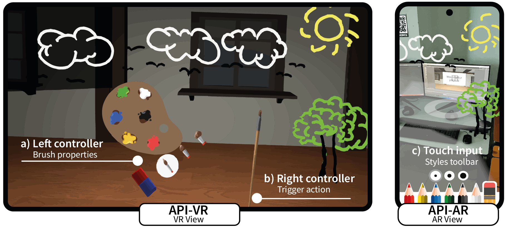

# A Framework Designed with Perceptual Symmetry and Interactive Asymmetry for XR Collaboration | Symmetry 2025

<div align="center">
  
  <p><em>Figure: Snapshot of two SRVS-C user interfaces in a collaborative spatial sketching scenario. Left API-VR interface: users draw in 3D space using handheld 6DoF controllers, selecting brush properties such as color and thickness via an in-world palette. Right API-AR interface: users draw via touch input on an ARCore-enabled smartphone screen, with brush customization available through an overlaid 2D toolbar</em></p>
</div>

<!--## Overview
This repository presents a framework designed to streamline the deployment and configuration of colocated collaborative augmented reality (AR) experiences for mobile devices (currently supporting ARCore-compatible devices). The solution employs a centralized client-server architecture, where a dedicated local server (PC) manages real-time data communication and synchronization across connected devices. This approach eliminates reliance on cloud anchor services or third-party platforms, which often impose restrictive limitations.

Perfect for:
- Prototyping multi-user AR experiences
- Collaborative projects
- AR education tools

## 🧩 Project Components

| Folder | Purpose | What You'll Find There |
|--------|---------|------------------------|
| `Server/` | Contains the complete architecture and technical configuration for the local server, including all necessary components and operational processes | Server code, database setup |
| `App/` | Includes the mobile application implementation that connects to and interacts with the server framework | Unity project, App setup |


## 🛠️ Setup Guide

### Before You Begin
You'll need:

✔ **Computer**: Windows/Mac/Linux with:
  - Node.js v22.12.0 ([installation guide](https://nodejs.org/en/download))
  - MongoDB 8.0.4 ([installation guide](https://www.mongodb.com/docs/manual/installation/))

✔ **Phones**: 2+ Android devices with:
  - ARCore support ([compatibility list](https://developers.google.com/ar/devices))
  - Developer mode enabled
    
✔ Refer to [SERVER.md](./Server/README.md) and [APP.md](./App/README.md) for setup instructions.

### Step 1: Get the Code
1. **Clone the repository** (download the project):
  ```bash
  git clone https://github.com/MurilloLog/CollabAR.git
  ```

2. **Navigate into the project folder**:
  ```bash
  cd CollabAR
  ```

### Step 2: Launch the Server
1. **Open two terminal windows** and navigate both to the `Server/` folder:
  ```bash
  cd Server
  ```
2.  **In first terminal (Database-MongoDB)**
- Start MongoDB
   ```bash
   mongod
   ```
   ✅ Successful confirmation

  Wait for the log message: [initandlisten] Waiting for connections.

3. **In the second Terminal (Application - Node.js)**
- Install dependencies (**first time only**):
```bash
npm install
```

- Start the server:
```bash
npm start
```
✅ Successful confirmation

Look for the message: "Wating for connections..."

⚠️ **Important Notes**:

- Do not close either terminal window while using the application.

- Closing the first terminal (mongod) will shut down the database.

- Closing the second terminal (npm start) will stop the server.

- To stop the servers safely: Press Ctrl + C in each terminal to terminate processes gracefully.

## 🎨 Using the App
1. **Connect Devices**:
  - **Positioning**: Point all device cameras at the **same flat surface** (table/floor).
  - **Connection**:
     - Enter the server’s IP:PORT address manually (found in [SERVER.md](./Server/README.md)).
     - Tap "Join" to sync devices.
     - Wait for all players
  - **Verification**:
    - Check terminal logs for "Client [IP] connected" confirmation

2. **Start Drawing**:
  - Choose colors from the palette in your app
  - Draw in the air – your strokes appear when you finish - others will see your drawings
  - Walk around - drawings stay anchored to their physical location

🔍 System Verification

To confirm the system is operating correctly:

1. **Check the server terminal** (where you ran npm start).
2. Look for these **key log messages**:

  - ✅ "Connecting to MongoDB..."
  - ✅ "Successful connection..."
  - ✅ "Waiting for connections..." 

## ❓ Common Questions
**Q: Why do devices need to be close together?**

A: Devices need to be close to share the same AR space and use a common reference point from the starting position for accurate synchronization

**Q: Can I use iPhones?**

A: Currently Android-only (ARCore requirement), but iOS support could be added.

**Q: How many users can join simultaneously?**

A. The system supports theoretically unlimited connections, but practical performance depends on:
- The PC specifications (CPU/RAM)
- Network conditions (latency and stability)
- Drawing complexity (size/detail of shared AR content)-->

## Please kindly cite our paper as:
```
@inproceedings{,
author = {},
title = {},
year = {2025},
isbn = {},
publisher = {},
address = {},
url = {},
doi = {},
series = {}
}
```


